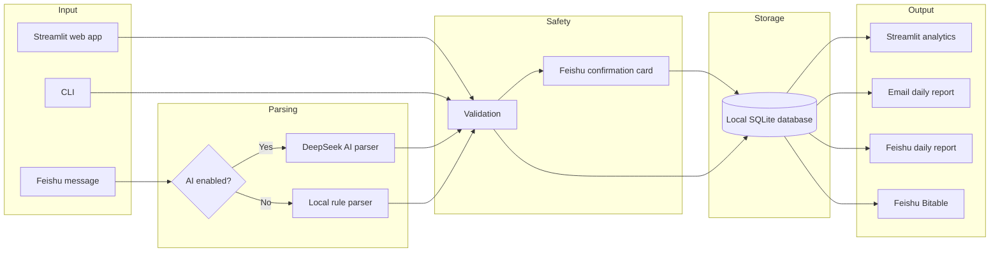

<p align="right">
  <a href="./README.md">中文</a> | <strong>English</strong>
</p>

# Finance Tracker Pro

**A local-first personal finance tracker** — record expenses from your phone, review reports on your computer, and keep your financial data under your control.


[](https://www.python.org/)
[](https://streamlit.io/)
[](https://www.sqlite.org/)
[](https://open.feishu.cn/)
[](LICENSE)

---

## Overview

**Finance Tracker Pro** is a personal finance tool designed for daily expense tracking, local data ownership, and lightweight automation.

It connects several workflows into one system:

- Record expenses from Feishu using natural language messages.
- Review transactions, trends, categories, and reports in a Streamlit dashboard.
- Store financial data locally in SQLite.
- Generate daily reports via email or Feishu.
- Optionally sync records to Feishu Bitable for BI-style dashboards.

This is not a commercial bookkeeping SaaS. It is a **local-first, privacy-friendly, extensible personal finance system**.

---

## Why This Project

Many finance apps have two common issues:

1. **Data ownership is unclear**: transaction data and spending habits are stored on third-party platforms.
2. **Recording expenses is too heavy**: opening an app, choosing a category, and filling fields is easy to skip in daily life.

Finance Tracker Pro is designed around a simpler workflow:

- **Record from your phone**: send a message such as `lunch 25` in Feishu.
- **Confirm before writing**: write operations are confirmed through Feishu cards before they enter the database.
- **Analyze from your computer**: use the Streamlit dashboard to review categories, trends, budgets, and reports.
- **Receive daily feedback**: generate daily summaries automatically.
- **Own your data**: keep the SQLite database and sensitive configuration locally.

---

## Core Features

| Module | Capability |
| --- | --- |
| Web tracking and analytics | Streamlit-based entry, filtering, statistics, and trend charts |
| Feishu mobile tracking | Record expenses by sending natural language messages to a Feishu bot |
| AI parsing | Optionally use DeepSeek to parse natural language into structured transactions |
| Local parser fallback | Fall back to local rule-based parsing when AI is unavailable |
| Confirmation cards | Confirm create, delete, and update actions before database writes |
| SQLite storage | Store the account book locally |
| Email reports | Generate and send daily finance summaries by email |
| Feishu reports | Push daily reports to Feishu conversations |
| Bitable sync | Sync transaction records one-way to Feishu Bitable |
| Scheduler | Run automated reports, sync tasks, and background services |
| Privacy protection | Keep `.env`, database files, logs, exports, and backups out of Git |

---

## Architecture



---

## Quick Start

### Requirements

- Python 3.10+
- Windows 10/11. Commands below use PowerShell.

### Installation

```powershell
# 1. Clone the repository
git clone https://github.com/kingoahuy/finance_tracker.git
cd finance_tracker

# 2. Create a virtual environment and install dependencies
python -m venv .venv
.\.venv\Scripts\activate
pip install -r requirements.txt

# 3. Configure environment variables
copy .env.example .env
# Edit .env and fill in email, Feishu, and AI settings as needed.

# 4. Initialize the database
python init_db.py

# 5. Start the Streamlit dashboard
python -m streamlit run finance_tracker\app.py
```

Open the dashboard at:

```text
http://127.0.0.1:8501
```

---

## Configuration

Copy `.env.example` to `.env` and fill in the required values.

| Category | Key variables | Description |
| --- | --- | --- |
| Base | `FINANCE_DB_FILE` | SQLite database file path |
| Base | `FINANCE_MONTHLY_BUDGET` | Monthly budget amount |
| Email report | `FINANCE_MAIL_HOST` / `FINANCE_MAIL_USER` / `FINANCE_MAIL_PASS` / `FINANCE_MAIL_RECEIVERS` | SMTP email settings |
| Feishu bot | `FEISHU_APP_ID` / `FEISHU_APP_SECRET` | Feishu app credentials |
| Feishu access control | `FEISHU_ALLOWED_OPEN_IDS` / `FEISHU_ALLOWED_CHAT_IDS` | Allowed users and chats |
| Bitable sync | `FEISHU_BITABLE_APP_TOKEN` / `FEISHU_BITABLE_TABLE_ID` | Feishu Bitable sync settings |
| AI parser | `DEEPSEEK_API_KEY` / `DEEPSEEK_MODEL` | Optional DeepSeek parser settings |

> Always use `.env.example` as the source of truth. Do not commit real `.env` files, email authorization codes, Feishu tokens, API keys, or personal transaction data.

---

## Feishu Bot Integration

The project supports a Feishu custom app using a long-connection bot. After setup, you can send natural language messages in a private chat or group chat to record expenses.

### Example Commands

```text
lunch 25
paid 32 for taxi yesterday
delete yesterday's subway record
generate today's report
```

Chinese examples are also supported depending on your parser configuration:

```text
午饭 25 元
昨天打车 32
删除昨天的地铁记录
生成今天日报
```

### Safety Design

- **Confirmation cards**: create, delete, and update operations require confirmation before writing to SQLite.
- **Whitelist control**: restrict access by Feishu user IDs and chat IDs.
- **Local validation**: amount, date, category, and user ownership are validated locally in Python.
- **AI fallback**: if DeepSeek is unavailable, the system falls back to local rule-based parsing.
- **One-way sync**: Feishu Bitable uses local SQLite as the source of truth.

Documentation:

- [Feishu bot setup guide](docs/feishu_setup.md)
- [Feishu Bitable setup guide](docs/feishu_bitable_setup.md)

---

## Common Commands

### CLI Tracking

```powershell
# Add transactions from text. Use semicolons to separate multiple items.
.\.venv\Scripts\python.exe finance_tracker\account_ops.py add-text "午饭 25; 地铁 4"

# Add transactions from JSON
$json = '[{"date":"2026-06-05","type":"支出","category":"餐饮","amount":25,"description":"午饭"}]'
$b64 = [Convert]::ToBase64String([Text.Encoding]::UTF8.GetBytes($json))
.\.venv\Scripts\python.exe finance_tracker\account_ops.py add-json --base64 $b64

# Show recent records
.\.venv\Scripts\python.exe finance_tracker\account_ops.py recent --limit 10
```

### Reports

```powershell
# Generate a report
.\.venv\Scripts\python.exe finance_tracker\account_ops.py report --date 2026-06-05

# Send an email report
.\.venv\Scripts\python.exe finance_tracker\account_ops.py send-report --date 2026-06-05

# Schedule a report
.\.venv\Scripts\python.exe finance_tracker\account_ops.py schedule-report --report-date 2026-06-05 --send-at "2026-06-06 08:00"
```

### Service Management

```powershell
.\start_all.bat        # Start Streamlit and scheduler
.\service_status.bat   # Check service status
.\stop_services.bat    # Stop all services
```

### Startup Task

```powershell
.\install_startup.bat    # Install startup task
.\uninstall_startup.bat  # Uninstall startup task
```

---

## Project Structure

```text
finance_tracker/
  app.py                    # Streamlit web interface
  ledger.py                 # Core ledger logic and SQLite operations
  config.py                 # Environment variable loading
  analytics.py              # Analytics and statistics
  tagging.py                # Category and tag management
  email_service.py          # Email report generation and SMTP delivery
  scheduler.py              # Background scheduler
  account_ops.py            # CLI utilities
  service_runner.py         # Process management
  ai_parser.py              # DeepSeek natural language parser
  transaction_service.py    # Transaction parsing, validation, and operations
  feishu_bot.py             # Feishu long-connection bot entrypoint
  feishu_client.py          # Feishu Open API wrapper
  feishu_config.py          # Feishu configuration loading
  feishu_commands.py        # Feishu command handlers
  feishu_menu_dispatcher.py # Feishu menu event dispatcher
  feishu_report.py          # Feishu report generation and delivery
  bitable_sync.py           # Feishu Bitable one-way sync

scripts/
  backup_database.ps1           # Database backup script
  service_control.ps1           # Service control script
  install_startup_task.ps1      # Install Windows startup task
  uninstall_startup_task.ps1    # Uninstall Windows startup task

docs/
  feishu_setup.md               # Feishu bot setup guide
  feishu_bitable_setup.md       # Feishu Bitable setup guide
```

---

## Privacy and Security

- Keep `.env` local.
- Keep SQLite database files local.
- Do not write email authorization codes, Feishu secrets, DeepSeek API keys, or real transaction data into README files.
- Ignore logs, exports, backups, and local account book files in `.gitignore`.
- Before publishing or sharing the repository, run:

```powershell
git status --ignored
```

Make sure sensitive files are not staged or committed.

---

## FAQ

### Is AI required?

No. If DeepSeek is not configured, the project can still use the local rule-based parser.

### Is Feishu required?

No. Feishu is the mobile entry point. You can still use the Streamlit dashboard and CLI tools without Feishu.

### Where is the data stored?

By default, the account book is stored in a local SQLite database. The path is controlled by `FINANCE_DB_FILE`.

### Will email authorization codes or Feishu tokens be uploaded?

No, as long as you do not commit `.env` or other local secret files.

### Can this run continuously on a local Windows PC?

Yes. The project provides scripts for starting services and installing a Windows startup task.

---

## Roadmap

- [ ] Enhanced Feishu custom menu
- [ ] Feishu BI dashboard
- [ ] Monthly budget alerts
- [ ] Bill import workflow
- [ ] Improved data backup and restore
- [ ] Multi-account / multi-user isolation
- [ ] README screenshots
- [ ] Docker deployment

---

## References

The README structure is inspired by several well-written open-source projects:

- [Actual Budget](https://github.com/actualbudget/actual): local-first personal finance positioning
- [Streamlit](https://github.com/streamlit/streamlit): quick start and data app presentation
- [Umami](https://github.com/umami-software/umami): privacy-focused messaging
- [Supabase](https://github.com/supabase/supabase): feature checklist and architecture explanation
- [Open WebUI](https://github.com/open-webui/open-webui): AI app installation and feature organization

---

## License

This project is licensed under the [MIT License](LICENSE). You may use,
study, modify, and redistribute the code while retaining the license notice.
