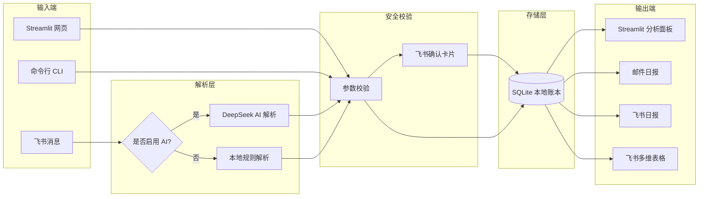

<p align="right">
  <strong>中文</strong> | <a href="./README.en.md">English</a>
</p>

# 智账 Pro

**本地优先的个人智能记账系统** — 手机发消息记账，电脑看报表分析，数据始终在你手里。


[](https://www.python.org/)
[](https://streamlit.io/)
[](https://www.sqlite.org/)
[](https://open.feishu.cn/)
[](LICENSE)

---

## 项目定位

**智账 Pro** 是一个面向个人使用的智能记账系统，核心目标是把“随手记账”和“财务分析”连接起来：

- 在手机端，通过飞书机器人用自然语言记账；
- 在电脑端，通过 Streamlit 查看账本、趋势、分类统计和日报；
- 在本地端，通过 SQLite 保存个人账本，避免把敏感消费数据托管到陌生平台；
- 在自动化端，通过邮件、飞书日报和多维表格同步，把记账数据变成持续可用的财务反馈。

这个项目不是商业记账 SaaS，而是一个**本地优先、隐私友好、可扩展的个人财务工具**。

---

## 为什么做这个项目

很多记账工具有两个问题：

1. **数据不可控**：账单、消费习惯和收入信息存放在第三方平台；
2. **记录链路太重**：打开 App、选择分类、填写金额的过程容易打断日常场景。

智账 Pro 的设计思路是：

- **手机上随时记**：在飞书里发一句“午饭 25 元”即可开始记账；
- **关键操作先确认**：删除、修改、记账等写操作先通过飞书确认卡片二次确认；
- **电脑上集中看**：Streamlit 面板用于查看分类、趋势、预算和日报；
- **日报自动生成**：每天自动总结消费、收入、预算进度和建议；
- **本地账本优先**：SQLite 数据库保存在本地，敏感配置不提交到 Git。

---

## 核心功能

| 模块 | 能力 |
| --- | --- |
| Web 记账与分析 | Streamlit 网页端录入、筛选、统计、趋势图表 |
| 飞书移动记账 | 通过飞书机器人在手机或电脑端发送自然语言完成记账 |
| AI 语义解析 | 可选接入 DeepSeek，将自然语言解析为结构化记账动作 |
| 本地解析回退 | 未配置 AI 或 AI 请求失败时，自动使用本地规则解析器 |
| 确认卡片 | 记账、删除、修改等写操作先确认再写入数据库 |
| SQLite 存储 | 使用本地 SQLite 数据库保存账本数据 |
| 邮件日报 | 自动生成并发送每日财务摘要 |
| 飞书日报 | 将日报推送到飞书会话中 |
| 多维表格同步 | 将流水单向同步到飞书多维表格，便于后续 BI 看板 |
| 定时任务 | 后台调度日报、同步、服务管理等任务 |
| 隐私保护 | `.env`、数据库、日志、导出文件和备份文件默认不提交 |

---

## 系统架构



---

## 快速开始

### 环境要求

- Python 3.10+
- Windows 10/11（当前命令以 PowerShell 为主）

### 安装步骤

```powershell
# 1. 克隆仓库
git clone https://github.com/kingoahuy/finance_tracker.git
cd finance_tracker

# 2. 创建虚拟环境并安装依赖
python -m venv .venv
.\.venv\Scripts\activate
pip install -r requirements.txt

# 3. 配置环境变量
copy .env.example .env
# 编辑 .env，按需填写邮箱、飞书、AI 等配置

# 4. 初始化数据库
python init_db.py

# 5. 启动 Streamlit 面板
python -m streamlit run finance_tracker\app.py
```

启动后访问：

```text
http://127.0.0.1:8501
```

---

## 配置说明

复制 `.env.example` 为 `.env`，按需填写。

| 类别 | 关键变量 | 说明 |
| --- | --- | --- |
| 基础配置 | `FINANCE_DB_FILE` | SQLite 数据库文件路径 |
| 基础配置 | `FINANCE_MONTHLY_BUDGET` | 月度预算金额 |
| 邮件日报 | `FINANCE_MAIL_HOST` / `FINANCE_MAIL_USER` / `FINANCE_MAIL_PASS` / `FINANCE_MAIL_RECEIVERS` | SMTP 邮件发送配置 |
| 飞书机器人 | `FEISHU_APP_ID` / `FEISHU_APP_SECRET` | 飞书自建应用凭证 |
| 飞书权限 | `FEISHU_ALLOWED_OPEN_IDS` / `FEISHU_ALLOWED_CHAT_IDS` | 允许使用机器人的用户或群聊白名单 |
| 多维表格 | `FEISHU_BITABLE_APP_TOKEN` / `FEISHU_BITABLE_TABLE_ID` | 飞书多维表格同步配置 |
| AI 解析 | `DEEPSEEK_API_KEY` / `DEEPSEEK_MODEL` | DeepSeek AI 解析配置，可选 |

> 完整配置以 `.env.example` 为准。不要把真实 `.env`、邮箱授权码、飞书 token、账本数据库提交到 GitHub。

---

## 飞书机器人接入

项目支持飞书自建应用长连接机器人。配置完成后，可以在飞书群聊或私聊中发送自然语言完成记账。

### 示例指令

```text
午饭 25 元
昨天打车 32
删除昨天的地铁记录
生成今天日报
```

### 安全机制

- **确认卡片**：记账、删除、修改等写操作先返回确认卡片，确认后才写入数据库；
- **白名单控制**：可限制允许使用机器人的用户和群聊；
- **本地校验**：金额、日期、分类、用户归属由本地 Python 逻辑校验；
- **AI 失败回退**：DeepSeek 未配置或请求失败时，自动切换到本地解析；
- **数据单向同步**：同步到飞书多维表格时，以本地 SQLite 账本为主数据源。

详细文档：

- [飞书机器人接入指南](docs/feishu_setup.md)
- [飞书多维表格配置](docs/feishu_bitable_setup.md)

---

## 常用命令

### CLI 记账

```powershell
# 文本记账，支持分号分隔多条
.\.venv\Scripts\python.exe finance_tracker\account_ops.py add-text "午饭 25; 地铁 4"

# JSON 记账
$json = '[{"date":"2026-06-05","type":"支出","category":"餐饮","amount":25,"description":"午饭"}]'
$b64 = [Convert]::ToBase64String([Text.Encoding]::UTF8.GetBytes($json))
.\.venv\Scripts\python.exe finance_tracker\account_ops.py add-json --base64 $b64

# 查看最近记录
.\.venv\Scripts\python.exe finance_tracker\account_ops.py recent --limit 10
```

### 日报

```powershell
# 生成日报
.\.venv\Scripts\python.exe finance_tracker\account_ops.py report --date 2026-06-05

# 发送邮件日报
.\.venv\Scripts\python.exe finance_tracker\account_ops.py send-report --date 2026-06-05

# 定时发送
.\.venv\Scripts\python.exe finance_tracker\account_ops.py schedule-report --report-date 2026-06-05 --send-at "2026-06-06 08:00"
```

### 服务管理

```powershell
.\start_all.bat        # 启动 Streamlit + 调度器
.\service_status.bat   # 查看运行状态
.\stop_services.bat    # 停止所有服务
```

### 开机自启

```powershell
.\install_startup.bat    # 安装开机自启任务
.\uninstall_startup.bat  # 卸载开机自启任务
```

---

## 项目结构

```text
finance_tracker/
  app.py                    # Streamlit 网页界面
  ledger.py                 # 核心记账逻辑与 SQLite 数据库操作
  config.py                 # 环境变量加载与 .env 解析
  analytics.py              # 数据分析与统计计算
  tagging.py                # 分类标签管理
  email_service.py          # 邮件日报生成与 SMTP 发送
  scheduler.py              # 后台定时任务调度器
  account_ops.py            # 命令行工具
  service_runner.py         # 服务进程管理
  ai_parser.py              # DeepSeek AI 自然语言解析
  transaction_service.py    # 事务处理、解析、校验
  feishu_bot.py             # 飞书长连接机器人入口
  feishu_client.py          # 飞书 Open API 封装
  feishu_config.py          # 飞书配置加载
  feishu_commands.py        # 飞书指令处理
  feishu_menu_dispatcher.py # 飞书菜单事件分发
  feishu_report.py          # 飞书日报生成与推送
  bitable_sync.py           # 飞书多维表格同步

scripts/
  backup_database.ps1           # 数据库备份脚本
  service_control.ps1           # 服务控制脚本
  install_startup_task.ps1      # 安装 Windows 开机自启任务
  uninstall_startup_task.ps1    # 卸载 Windows 开机自启任务

docs/
  feishu_setup.md               # 飞书机器人接入指南
  feishu_bitable_setup.md       # 飞书多维表格配置指南
```

---

## 隐私与安全

- `.env` 只保存在本地，不应提交；
- SQLite 数据库文件只保存在本地，不应提交；
- 邮箱授权码、飞书 App Secret、DeepSeek API Key 不应写入 README 或示例账本；
- 日志、导出文件、备份文件建议全部加入 `.gitignore`；
- 公开仓库前，建议执行：

```powershell
git status --ignored
```

确认敏感文件没有进入暂存区或提交历史。

---

## FAQ

### 是否必须配置 AI？

不必须。未配置 DeepSeek 时，项目会使用本地规则解析器，基础记账功能仍可使用。

### 是否必须配置飞书？

不必须。飞书是移动端入口。你仍然可以使用 Streamlit 网页端和 CLI 工具记账。

### 数据存在哪里？

默认存储在本地 SQLite 数据库中，数据库路径由 `FINANCE_DB_FILE` 控制。

### 邮箱授权码、飞书 token 会不会上传？

不会。只要你不手动提交 `.env`，这些敏感信息不会进入 GitHub。

### 本地电脑可以长期运行吗？

可以。项目支持通过脚本启动 Streamlit 和调度器，也可以配置 Windows 开机自启。

---

## Roadmap

- [ ] 飞书自定义菜单增强
- [ ] 飞书 BI 看板完善
- [ ] 月度预算预警
- [ ] 账单导入
- [ ] 数据备份与恢复流程优化
- [ ] 多账户 / 多用户隔离
- [ ] README 截图补充
- [ ] Docker 部署方案

---

## 参考项目

本项目的 README 结构参考了以下优秀开源项目的表达方式：

- [Actual Budget](https://github.com/actualbudget/actual)：local-first personal finance 定位
- [Streamlit](https://github.com/streamlit/streamlit)：数据应用快速开始与示例展示
- [Umami](https://github.com/umami-software/umami)：privacy-focused 项目表达
- [Supabase](https://github.com/supabase/supabase)：功能清单与架构说明
- [Open WebUI](https://github.com/open-webui/open-webui)：AI 应用的安装与功能组织

---

## License

This project is licensed under the [MIT License](LICENSE).
