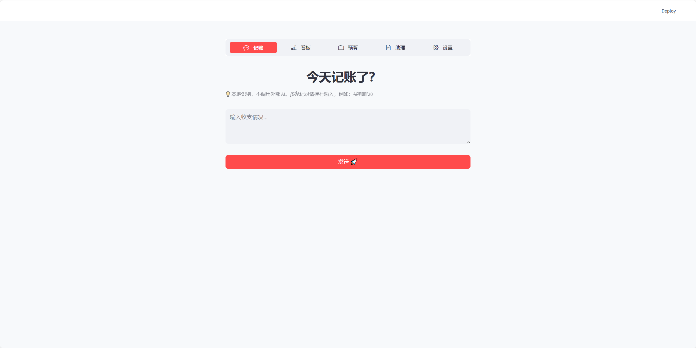
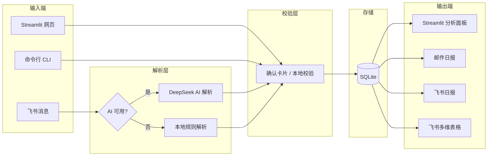

# 智账 Pro

**本地优先的个人智能记账系统** — 手机发消息记账，电脑看报表分析，数据始终在你手里。

A privacy-first, local SQLite-powered personal finance tracker with Feishu bot integration, AI-powered natural language parsing, and automated daily reports.

[](https://www.python.org/)
[](https://streamlit.io/)
[](https://www.sqlite.org/)
[](LICENSE)

---

## 预览



<!-- 后续补充的截图 -->
<!--  -->
<!--  -->

---

## 为什么做这个项目

市面上的记账工具大多把数据存在云端，你无法控制数据流向；而纯本地的命令行工具又缺少移动端入口，日常随手记不方便。

**智账 Pro** 的设计目标很简单：

- **手机上随时记** — 打开飞书发一句话就完成记账，不用打开任何 App
- **电脑上查看分析** — Streamlit 面板提供分类统计、趋势图表
- **每天自动生成日报** — 邮件或飞书推送，不用自己翻账本
- **数据完全在本地** — SQLite 存储，不依赖任何云服务，隐私由你掌控
- **可选对接飞书多维表格** — 流水单向同步到 Bitable，方便后续做 BI 看板

---

## 核心功能

### Web 记账与分析

Streamlit 网页端支持手动录入、分类筛选、按月统计和趋势图表，适合在电脑前集中查看账目。

### 飞书移动记账

通过飞书自建应用的长连接机器人，在群聊或私聊中发送自然语言即可记账：

| 示例指令 | 效果 |
| --- | --- |
| `午饭 25 元` | 记一笔 25 元餐饮支出 |
| `昨天打车 32` | 记昨天交通支出 32 元 |
| `删除昨天的地铁记录` | 删除匹配的记录 |
| `生成今天日报` | 立即生成当日财务摘要 |

每条指令都会先弹出**确认卡片**，确认后才真正写入数据库，避免误操作。

### AI 语义解析

可选接入 DeepSeek API，用大模型理解复杂的自然语言表述。未配置 API Key 或请求失败时，自动回退到本地正则解析器，核心功能不受影响。

### 邮件日报 / 飞书日报

每日自动生成 Markdown 格式的财务摘要，可通过邮件或飞书消息推送。

### 多维表格同步

记账数据可单向同步到飞书多维表格（Bitable），利用飞书的仪表盘能力做可视化分析。

### 定时任务

后台调度器负责每日日报生成、多维表格自动同步等周期任务，Windows 开机自启可选。

### 隐私保护

所有敏感数据（`.env`、SQLite 数据库、日志、导出文件、备份）均在 `.gitignore` 中排除，不会提交到 Git 仓库。

---

## 系统架构



---

## 快速开始

### 环境要求

- Python 3.10+
- Windows 10/11（PowerShell）

### 安装步骤

```powershell
# 1. 克隆仓库
git clone https://github.com/kingoahuy/finance_tracker.git
cd finance_tracker

# 2. 创建虚拟环境并安装依赖
python -m venv .venv
.\.venv\Scripts\activate
pip install -r requirements.txt

# 3. 配置环境变量
copy .env.example .env
# 编辑 .env，按需填写（见下方配置说明）

# 4. 初始化数据库
python init_db.py

# 5. 启动 Streamlit 面板
python -m streamlit run finance_tracker\app.py
```

浏览器访问 `http://127.0.0.1:8501` 即可使用。

---

## 配置说明

复制 `.env.example` 为 `.env`，按需填写以下配置：

| 类别 | 关键变量 | 说明 |
| --- | --- | --- |
| 基础 | `FINANCE_DB_FILE` | 数据库文件路径，默认 `my_account_book.db` |
| 基础 | `FINANCE_MONTHLY_BUDGET` | 月度预算（元），默认 2000 |
| 邮件 | `FINANCE_MAIL_HOST` / `USER` / `PASS` / `RECEIVERS` | SMTP 邮件配置，邮件功能需要 |
| 飞书 | `FEISHU_APP_ID` / `APP_SECRET` | 飞书自建应用凭证 |
| 飞书 | `FEISHU_ALLOWED_OPEN_IDS` | 用户白名单，限制谁可以使用机器人 |
| 多维表格 | `FEISHU_BITABLE_APP_TOKEN` / `TABLE_ID` | 飞书多维表格凭证 |
| AI | `DEEPSEEK_API_KEY` | DeepSeek API Key（可选，不填则用本地解析） |

完整变量列表见 `.env.example` 注释。

> 详细配置文档计划补充：`docs/configuration.md`

---

## 飞书机器人接入

### 使用方式

在飞书群聊或私聊中发送自然语言，机器人会解析并弹出确认卡片，确认后写入账本。

### 示例指令

```
午饭 25 元
昨天打车 32
删除昨天的地铁记录
生成今天日报
```

### 安全机制

- **确认卡片** — 所有写操作（记账、删除、修改）必须经用户确认后才生效
- **白名单** — 通过 `FEISHU_ALLOWED_OPEN_IDS` 和 `FEISHU_ALLOWED_CHAT_IDS` 限制访问
- **本地校验** — 金额、日期、分类、用户归属均由本地 Python 代码校验，不依赖 AI 输出
- **AI 失败回退** — 未配置 DeepSeek 或请求超时时，自动使用本地正则解析器

详细配置步骤见：

- [飞书机器人接入指南](docs/feishu_setup.md)
- [飞书多维表格配置](docs/feishu_bitable_setup.md)

---

## 常用命令

### CLI 记账

```powershell
# 文本记账（分号分隔多条）
.\.venv\Scripts\python.exe finance_tracker\account_ops.py add-text "午饭 25; 地铁 4"

# JSON 记账
$json = '[{"date":"2026-06-05","type":"支出","category":"餐饮","amount":25,"description":"午饭"}]'
$b64 = [Convert]::ToBase64String([Text.Encoding]::UTF8.GetBytes($json))
.\.venv\Scripts\python.exe finance_tracker\account_ops.py add-json --base64 $b64

# 查看最近记录
.\.venv\Scripts\python.exe finance_tracker\account_ops.py recent --limit 10
```

### 日报

```powershell
# 生成日报
.\.venv\Scripts\python.exe finance_tracker\account_ops.py report --date 2026-06-05

# 发送邮件日报
.\.venv\Scripts\python.exe finance_tracker\account_ops.py send-report --date 2026-06-05

# 定时发送
.\.venv\Scripts\python.exe finance_tracker\account_ops.py schedule-report --report-date 2026-06-05 --send-at "2026-06-06 08:00"
```

### 服务管理（Windows）

```powershell
.\start_all.bat        # 启动 Streamlit + 调度器
.\service_status.bat   # 查看运行状态
.\stop_services.bat    # 停止所有服务
```

### 开机自启

```powershell
.\install_startup.bat    # 安装开机自启任务
.\uninstall_startup.bat  # 卸载开机自启任务
```

---

## 项目结构

```
finance_tracker/
  app.py                    # Streamlit 网页界面
  ledger.py                 # 核心记账逻辑与 SQLite 数据库操作
  config.py                 # 环境变量加载与 .env 解析
  analytics.py              # 数据分析与统计计算
  tagging.py                # 分类标签管理
  email_service.py          # 邮件日报生成与 SMTP 发送
  scheduler.py              # 后台定时任务调度器
  account_ops.py            # 命令行工具（文本/JSON 记账、日报、服务管理）
  service_runner.py         # 进程管理（Streamlit + 调度器守护）
  ai_parser.py              # DeepSeek AI 自然语言解析
  transaction_service.py    # 事务处理服务（创建、文本解析、校验）
  feishu_bot.py             # 飞书长连接机器人入口
  feishu_client.py          # 飞书 Open API 封装
  feishu_config.py          # 飞书相关配置加载
  feishu_commands.py        # 飞书指令处理（记账、删除、修改、日报）
  feishu_menu_dispatcher.py # 飞书菜单事件分发
  feishu_report.py          # 飞书日报生成与推送
  bitable_sync.py           # 飞书多维表格单向同步

scripts/
  backup_database.ps1           # 数据库备份脚本
  service_control.ps1           # 服务控制（启动/停止/状态）
  install_startup_task.ps1      # 安装 Windows 开机自启任务
  uninstall_startup_task.ps1    # 卸载 Windows 开机自启任务
  install_startup_shortcut.ps1  # 创建桌面快捷方式
  uninstall_startup_shortcut.ps1 # 删除桌面快捷方式

tests/                            # pytest 测试套件（18 个测试文件）

docs/
  feishu_setup.md                 # 飞书机器人接入指南
  feishu_bitable_setup.md         # 飞书多维表格配置指南

init_db.py                        # 数据库初始化脚本
.env.example                      # 环境变量模板
requirements.txt                  # Python 依赖
```

---

## 隐私与安全

- **数据本地存储** — 所有账目保存在本地 SQLite 文件中，不上传到任何云服务
- **敏感文件排除** — `.env`、数据库、日志、导出文件、备份均在 `.gitignore` 中，不会提交到 Git
- **无云端依赖** — 核心功能不依赖任何远程服务，断网也能用
- **AI 可选** — DeepSeek API 仅用于自然语言解析，账目数据不会发送到 AI 服务
- **白名单控制** — 飞书机器人支持用户和群聊白名单，防止未授权访问

部署或分享前，可运行 `git status --ignored` 检查本地隐私文件是否处于忽略状态。

> 请勿把真实邮箱、授权码、账单数据或飞书 Token 写入 `.env.example` 或提交到 Git。

---

## 常见问题

**Q: 必须配置 AI 才能用吗？**

不是。不填 `DEEPSEEK_API_KEY` 时，系统自动使用本地正则解析器，记账功能完全可用。AI 只是让自然语言理解更灵活。

**Q: 必须配置飞书才能用吗？**

不是。飞书机器人是可选功能，只用 Streamlit 网页端和命令行也完全可以。

**Q: 数据存在哪里？**

默认存在项目根目录的 `my_account_book.db`（SQLite 文件），可通过 `FINANCE_DB_FILE` 环境变量修改路径。

**Q: 邮箱授权码会不会上传到 GitHub？**

不会。`.env` 文件在 `.gitignore` 中，只有 `.env.example`（不含真实凭证）会被提交。

**Q: 本地电脑能长期运行吗？**

可以。`start_all.bat` 会启动 Streamlit 和后台调度器，`install_startup.bat` 可设置开机自动启动。建议配合 `scripts\backup_database.ps1` 定期备份数据库。

---

## 路线图

- [ ] 飞书移动端菜单增强（快捷按钮、账单查询）
- [ ] 飞书多维表格 BI 看板
- [ ] 月度预算预警通知
- [ ] 账单批量导入（CSV / Excel）
- [ ] 数据备份与恢复工具
- [ ] 多账户 / 多用户隔离

---

## 参考项目

- [Actual Budget](https://github.com/actualbudget/actual) — local-first 个人预算工具
- [Firefly III](https://github.com/firefly-iii/firefly-iii) — 自托管财务管理
- [Umami](https://github.com/umami-software/umami) — 隐私优先的网站分析

---

## License

[MIT](LICENSE)